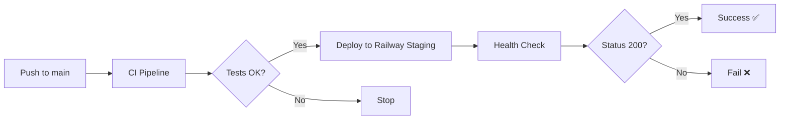
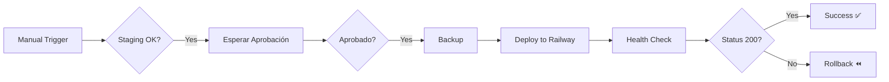

# Guía de Configuración de Railway para CI/CD

Esta guía te ayudará a configurar Railway.app como plataforma de deployment para tu aplicación Laravel, reemplazando la necesidad de servidores tradicionales con SSH.

## 📋 Contenido

1. [Ventajas de Railway](#ventajas-de-railway)
2. [Configuración Inicial](#configuración-inicial)
3. [Configuración de Servicios](#configuración-de-servicios)
4. [Variables de Entorno](#variables-de-entorno)
5. [GitHub Environments y Secrets](#github-environments-y-secrets)
6. [Flujo de Deployment](#flujo-de-deployment)
7. [Troubleshooting](#troubleshooting)

---

## 🚀 Ventajas de Railway

Railway simplifica el deployment eliminando la necesidad de:
- ❌ Configurar servidores manualmente
- ❌ Gestionar SSH keys
- ❌ Configurar rsync y atomic symlinks
- ❌ Instalar y configurar Nginx/Apache
- ❌ Gestionar certificados SSL

Railway proporciona:
- ✅ Deploy automático desde GitHub
- ✅ Base de datos PostgreSQL incluida
- ✅ Redis incluido
- ✅ SSL automático
- ✅ Rollback con un click
- ✅ Logs centralizados
- ✅ Health checks automáticos

---

## 🔧 Configuración Inicial

### 1. Crear cuenta en Railway

1. Ve a [railway.app](https://railway.app)
2. Haz clic en "Start a New Project"
3. Conecta tu cuenta de GitHub cuando se te solicite
4. Autoriza Railway para acceder a tus repositorios

### 2. Crear proyectos para Staging y Production

Necesitas **DOS proyectos separados** en Railway:

#### Proyecto de Staging
1. Click "New Project"
2. Selecciona "Deploy from GitHub repo"
3. Elige tu repositorio `sistema-ventas`
4. Nombre del proyecto: `sistema-ventas-staging`
5. Configura el branch: `main`

#### Proyecto de Production
1. Click "New Project" nuevamente
2. Selecciona "Deploy from GitHub repo"
3. Elige tu repositorio `sistema-ventas`
4. Nombre del proyecto: `sistema-ventas-production`
5. Configura el branch: `main` (el deployment será manual vía GitHub Actions)

---

## 🗄️ Configuración de Servicios

### Para cada proyecto (Staging y Production):

#### 1. Agregar PostgreSQL

1. En el dashboard del proyecto, click "+ New"
2. Selecciona "Database" → "Add PostgreSQL"
3. Railway creará automáticamente la base de datos
4. **Importante**: Anota las variables de conexión (Railway las expone automáticamente)

Variables disponibles automáticamente:
```
DATABASE_URL
PGHOST
PGPORT
PGUSER
PGPASSWORD
PGDATABASE
```

#### 2. Agregar Redis

1. Click "+ New" nuevamente
2. Selecciona "Database" → "Add Redis"
3. Railway lo configurará automáticamente

Variables disponibles:
```
REDIS_URL
REDIS_HOST
REDIS_PORT
REDIS_PASSWORD
```

---

## 🔐 Variables de Entorno

### Configurar variables en Railway

Para **cada proyecto** (Staging y Production):

1. Ve al servicio de tu aplicación (no la base de datos)
2. Click en "Variables"
3. Agrega las siguientes variables:

#### Variables Requeridas

```bash
# App
APP_NAME="Sistema Ventas"
APP_KEY=base64:tu_app_key_aquí  # Genera con: php artisan key:generate --show
APP_DEBUG=false
APP_URL=https://tu-app.up.railway.app

# Environment (DIFERENTE para staging/production)
APP_ENV=staging  # o "production"

# Database (Railway las configura automáticamente, pero puedes referenciarlas)
DB_CONNECTION=pgsql
DB_HOST=${PGHOST}
DB_PORT=${PGPORT}
DB_DATABASE=${PGDATABASE}
DB_USERNAME=${PGUSER}
DB_PASSWORD=${PGPASSWORD}

# Cache & Session
CACHE_DRIVER=redis
SESSION_DRIVER=redis
REDIS_HOST=${REDIS_HOST}
REDIS_PASSWORD=${REDIS_PASSWORD}
REDIS_PORT=${REDIS_PORT}

# Queue
QUEUE_CONNECTION=redis

# Logging
LOG_CHANNEL=stack
LOG_LEVEL=info  # "info" para staging, "error" para production
LOG_STDERR_FORMATTER=json

# Las siguientes son configuradas automáticamente por GitHub Actions:
# APP_RELEASE_VERSION (configurado por CI/CD)
# APP_RELEASE_COMMIT (configurado por CI/CD)
# APP_RELEASE_BRANCH (configurado por CI/CD)
# APP_RELEASE_TIMESTAMP (configurado por CI/CD)
```

#### Variables específicas de Production

```bash
APP_ENV=production
APP_DEBUG=false
LOG_LEVEL=error
```

#### Variables específicas de Staging

```bash
APP_ENV=staging
APP_DEBUG=false
LOG_LEVEL=info
```

---

## 🔑 GitHub Environments y Secrets

### 1. Instalar Railway CLI localmente (para obtener tokens)

```bash
npm install -g @railway/cli
railway login
```

### 2. Obtener tokens de proyecto

#### Para Staging:
```bash
# En tu proyecto de staging
railway environment staging
railway token
```

Copia el token que aparece (empieza con `railway_token_...`)

#### Para Production:
```bash
# En tu proyecto de production
railway environment production
railway token
```

Copia el token (será diferente al de staging)

### 3. Configurar GitHub Environments

1. Ve a tu repositorio en GitHub
2. Settings → Environments → "New environment"

#### Environment: `staging`

1. Nombre: `staging`
2. **No requiere aprobación manual**
3. Agrega el secret:
   - Name: `RAILWAY_STAGING_TOKEN`
   - Value: (el token de staging que copiaste)

#### Environment: `production`

1. Nombre: `production`
2. **Requiere aprobación manual** ✅
   - Marca "Required reviewers"
   - Agrega tu usuario como reviewer
3. Agrega el secret:
   - Name: `RAILWAY_PRODUCTION_TOKEN`
   - Value: (el token de production que copiaste)

### 4. Agregar Secrets a nivel de repositorio

Ve a Settings → Secrets and variables → Actions → "New repository secret"

No necesitas agregar secrets adicionales si usas Environments correctamente.

---

## 🚦 Flujo de Deployment

### Staging (Automático)



**Proceso:**
1. Haces `git push origin main`
2. GitHub Actions ejecuta el workflow `ci.yml`
3. Si CI pasa, se ejecuta automáticamente `deploy_staging_railway.yml`
4. Railway hace build y deploy
5. Se ejecuta health check en `/api/health`
6. Si health check pasa → Deploy exitoso ✅

### Production (Manual con Aprobación)



**Proceso:**
1. Ve a Actions → "Deploy to Production (Railway)"
2. Click "Run workflow"
3. Escribe **"DEPLOY"** para confirmar
4. Espera aprobación de un reviewer
5. Una vez aprobado, Railway hace deploy
6. Health check automático
7. Si falla → Rollback automático

---

## 📊 Monitoreo y Observabilidad

### Logs en Railway

1. Ve al dashboard de Railway
2. Selecciona tu proyecto
3. Click en "Deployments"
4. Selecciona el deployment actual
5. Verás logs en tiempo real

### Formato de logs

Todos los logs incluyen contexto automático gracias al middleware `LogRequestContext`:

```json
{
  "message": "Venta registrada",
  "context": {
    "environment": "production",
    "release_version": "main-abc123-20260128-143000",
    "release_commit": "abc123",
    "user_id": 5,
    "request_id": "550e8400-e29b-41d4-a716-446655440000",
    "venta_id": 123,
    "codigo": "V-2026-0001",
    "cliente_id": 42,
    "total": 1500.00
  }
}
```

### Health Check

Endpoint: `https://tu-app.up.railway.app/api/health`

Respuesta exitosa:
```json
{
  "status": "ok",
  "timestamp": "2026-01-28T14:30:00Z",
  "environment": "production",
  "version": "main-abc123-20260128-143000",
  "commit": "abc123",
  "branch": "main",
  "deployed_at": "2026-01-28T14:30:00Z",
  "checks": {
    "db": {
      "ok": true,
      "latency_ms": 12,
      "driver": "pgsql"
    },
    "cache": {
      "ok": true,
      "driver": "redis"
    },
    "storage": {
      "ok": true,
      "writable": true
    }
  }
}
```

---

## 🔍 Troubleshooting

### Error: "Railway token not found"

**Solución:**
1. Verifica que hayas configurado el secret correctamente en GitHub
2. El nombre debe ser exactamente `RAILWAY_STAGING_TOKEN` o `RAILWAY_PRODUCTION_TOKEN`
3. El token debe empezar con `railway_token_`

### Error: "Health check failed"

**Causas comunes:**
1. **Database no conecta**: Verifica las variables `PGHOST`, `PGPORT`, etc.
2. **Migrations fallaron**: Ve a Railway logs para ver el error específico
3. **Port incorrecto**: Railway usa la variable `$PORT`, verifica que tu `railway.json` la use

**Solución:**
```bash
# Ver logs en Railway
railway logs --service <nombre-servicio>

# O desde el dashboard web
```

### Error: "Build failed"

**Causas comunes:**
1. `composer install` falló (dependencias incompatibles)
2. `npm run build` falló (error en frontend)
3. Falta `APP_KEY` en variables de entorno

**Solución:**
1. Ve a Railway → Deployments → Click en el deployment fallido
2. Lee los logs de build
3. Corrige el error localmente primero
4. Haz push nuevamente

### Rollback Manual

Si necesitas hacer rollback a una versión anterior:

1. Ve a Railway dashboard
2. Deployments → Encuentra el deployment anterior que funcionaba
3. Click en los tres puntos (...) → "Redeploy"
4. Confirma

O desde CLI:
```bash
railway rollback --yes
```

### Ver variables de entorno actuales

```bash
railway variables --json
```

---

## 📚 Recursos Adicionales

- [Railway Docs](https://docs.railway.app/)
- [Railway CLI Reference](https://docs.railway.app/develop/cli)
- [Laravel Deployment Guide](https://laravel.com/docs/deployment)
- [GitHub Actions with Railway](https://docs.railway.app/deploy/integrations)

---

## 🎯 Checklist de Configuración

Usa este checklist para asegurarte de que todo está configurado:

### Railway Setup
- [ ] Cuenta de Railway creada
- [ ] Proyecto de Staging creado
- [ ] Proyecto de Production creado
- [ ] PostgreSQL agregado a ambos proyectos
- [ ] Redis agregado a ambos proyectos
- [ ] Variables de entorno configuradas en Staging
- [ ] Variables de entorno configuradas en Production
- [ ] Dominios configurados (opcional)

### GitHub Setup
- [ ] Environment `staging` creado
- [ ] Environment `production` creado
- [ ] Secret `RAILWAY_STAGING_TOKEN` configurado
- [ ] Secret `RAILWAY_PRODUCTION_TOKEN` configurado
- [ ] Production requiere aprobación manual
- [ ] Revisor asignado para Production

### Testing
- [ ] Push a `main` dispara CI
- [ ] CI exitoso dispara deploy a Staging
- [ ] Staging deploy funciona correctamente
- [ ] Health check pasa en Staging
- [ ] Deploy manual a Production funciona
- [ ] Aprobación requerida para Production
- [ ] Health check pasa en Production
- [ ] Logs muestran contexto completo (version, user_id, etc.)

---

## 🚨 Importante

1. **Nunca** commitees tokens o secrets al repositorio
2. **Siempre** prueba en staging antes de production
3. **Verifica** el health check después de cada deploy
4. **Monitorea** los logs después de deploy a production
5. **Ten** un plan de rollback listo

---

¿Problemas? Revisa:
1. Railway dashboard → Logs
2. GitHub Actions → Workflow runs
3. `/api/health` endpoint
4. Esta guía en sección de troubleshooting
